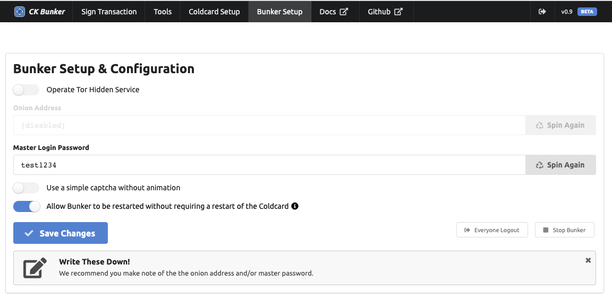

# Setup of Your CKBunker

Step 1 is to install the bunker code and get it running.

Once it's running, use any ordinary browser to connect to:

    http://localhost:9823/setup

At this point, you should be focused on the two tabs "Coldcard Setup"
and "Bunker Setup" tabs.

## Coldcard Setup tab

"Coldcard Setup" is devoted to creating an HSM spending policy. These settings
are held in a JSON file to be uploaded and confirmed on the Coldcard.

Typically the Bunker will send the file to the Coldcard when you
press "Save & Start Policy" but you have the option of downloading
the file, and/or importing the JSON file before that point. This is useful if you
want to hand-edit the data, or keep a backup/restore a backup. When you
send the file to the Coldcard, your browser will download a copy of the file,
if the checkbox "Download (sanitized) copy" is set. This version of the policy
file will have the following sensitive fields stripped out:

- `boot_to_hsm` - unlock code for
- `set_sl`, `allow_sl` - details of the storage locker

Continue reading [here for details about HSM rules and policy.](rules.md)

### Using Coldcard Setup _without_ a Coldcard

By using the "Download Policy" button you can use the pretty web
interface to build your policy file without using any other part
of the CKBunker. In fact a Coldcard does not need to be connected.

The only limitation of this mode is the _Users_ section. It communicates
directly with the Coldcard to read the list of users and add/remove them.
If you are using those features, you may need to edit the JSON.

If you use the Bunker to upload your policy, the `allow_sl` and
`set_sl` fields will be overriden by the Bunker and replaced. You
can use `ckcc hsm-start file.json` to upload the JSON policy file,
and start HSM mode on the command line.

## Bunker Setup tab

There are only a few settings for the Bunker itself:

- Enable or disable Tor Hidden Service: Once enabled, you may
  generate a different onion address by picking "Spin Again".

- Master Login password: this password is needed to get in to the CKBunker
  over the Tor network. There are no usernames. Cannot be shorter than 4 characters.

- Simple captcha: on the login form, there are two possible styles of captcha.

    -  Simple Captcha

    

    - Animated Captcha

    

- "Allow Bunker to be restarted without requiring a restart of the Coldcard":
    This setting should be configured before you save and apply your HSM policy
    on the "Coldcard Setup" page. It controls the number `allow_sl` inside
    the policy, and sets that value to `1` or `13`. If it's `1`, then the
    Coldcard will allow only a single read of the Storage Locker, and the
    effect of that is the CKBunker can only be reset/started once without
    knowing the PIN of the Coldcard.

### How Bunker Settings are Saved

In our security model, we assume the CKBunker may be "captured" by
your adversaries. The CKBunker is not the last line of defense---that's the Coldcard
and your HSM policy.

If the Bunker is captured while it is turned on and running, then
in the worst case, the attackers can read all of main memory, and
will get the Tor Hidden service private key. This will allow them
to impersonate your Bunker in the future. Presumably they can view
your PSBT file and all other web interactions while you work with the Bunker.

However, they cannot change the HSM policy of the Coldcard. They
do not know the TOTP/2FA secrets, and cannot generate OTP codes
(only the Coldcard knows those) and so they cannot authorize spending
that way and impersonate users.

When the data associated with the Bunker is "at rest", meaning the
system is not running, we have good protections in place. All Bunker
settings are saved to `./data` directory, as encrypted files. The
name of the file is a hash of the private key, and the contents are
a NaCl secret box (Curve25519). We store the private key for that
file on the Coldcard itself, in the storage locker.

When the Bunker starts, it searchs for a Coldcard on USB (and it also
looks for the simulator). If it finds one already in HSM mode, then
it reads the storage locker and uses the NaCl private key (32 bytes)
to select and open the corresponding Bunker settings file. Therefore,
each Coldcard has it's own settings for the Bunker. 

Before a Coldcard is connected, or before the policy is saved for
the first time, the settings are held with a fixed key, and end up
in file: `data/bp-1850f665aa1e22c0.dat` based on that key. At the
point where you upload a new policy to a Coldcard, a new key is
picked and added to the policy file. Data on disk at that point is
re-encrypted and moved over.

#### Other Notes

- PSBT files are never saved to disk. They stay in-memory only.
- HSM Policy files are not saved to disk, except as part of the settings.
- If you don't choose _Privacy over UX_ then many key details of your HSM
  policy are captured and saved into the encrypted settings. This includes details
like the HSM text summary, user names, and other details that are know only
when the policy is created.

